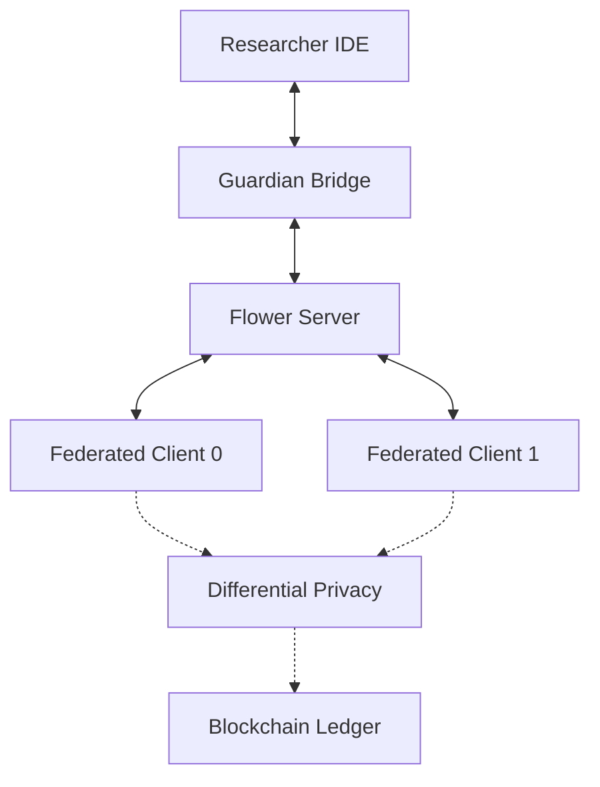

# 🛡️ AI Guardian | Secure Federated Learning Laboratory

A premium, institutional-grade platform for **Secure Federated Learning (SFL)**. This project transforms complex decentralized training into a high-performance research IDE, prioritizing **Privacy**, **Stability**, and **Intuitive AI Development**.

---

## 🚀 Key Features

*   **🔒 Privacy-Preserving Training**: Integrated **Local Differential Privacy (DP)** with Gaussian noise injection and institutional ε-privacy shielding.
*   **🧪 Research Laboratory**: A fully integrated IDE and **Interactive Research Shell (REPL)** for real-time Python model experimentation and dependency management.
*   **⛓️ Blockchain Integrity**: In-memory PoW blockchain providing a permanent, immutable audit trail for all federated weight updates.
*   **⚛️ Terminal Chic Dashboard**: A state-of-the-art React dashboard with real-time WebSockets, glassmorphism aesthetics, and "600ms Ultra-Low Latency" telemetry.
*   **🛡️ Nuclear Safety Hardening**: Engineered against networking failures (Broken Pipe), malformed inputs, and sandbox instability.

---

## 🛠️ Quick Start

### 1. Prerequisites
- Python 3.9+
- Node.js 18+ (for Dashboard)

### 2. Installation
```bash
git clone https://github.com/ImBajrangi/FederatedLearningSystem.git
cd secure_federated_learning
pip install -r requirements.txt
cd dashboard && npm install
```

### 3. Launch the Stack
```bash
# Terminal 1: Start the Backend (Server & Federated Clients)
python3 run_local.py

# Terminal 2: Start the Research Dashboard
cd dashboard && npm run dev
```

---

## 🏗️ Architecture



---

## 📘 Documentation
For a deep dive into the system mechanics, see:
- 📖 **[System Documentation](documentation.md)**: Architecture, Safety Protocols, and "Script vs Model" modalities.
- 🧪 **[Research Shell Guide](documentation.md#2-the-research-laboratory-ide)**: How to use the interactive terminal.

---

## 🎨 Visualization Dashboard
The new **Laboratory Dashboard** (replacing the legacy static visualizer) provides:
- **Real-time Metrics**: Live convergence curves for global loss and accuracy.
- **Node Health**: Live telemetry from the virtual sandbox and system environment.
- **Model Export**: One-click download of converged weights in `.pt` and `.onnx` formats.

---
*© 2026 Cybronites Institutional Research. Optimized for High-Security Environments.*
